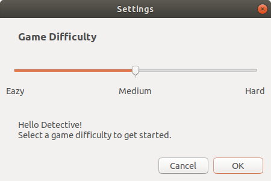
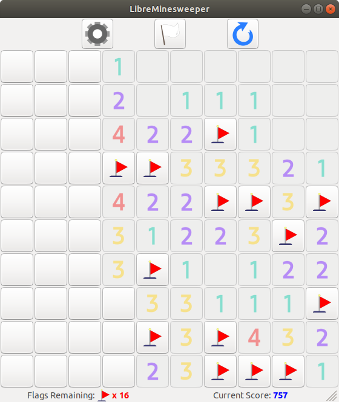
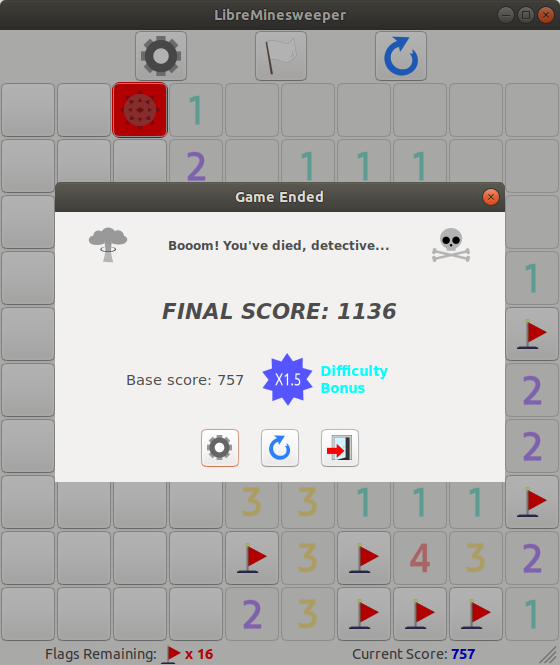
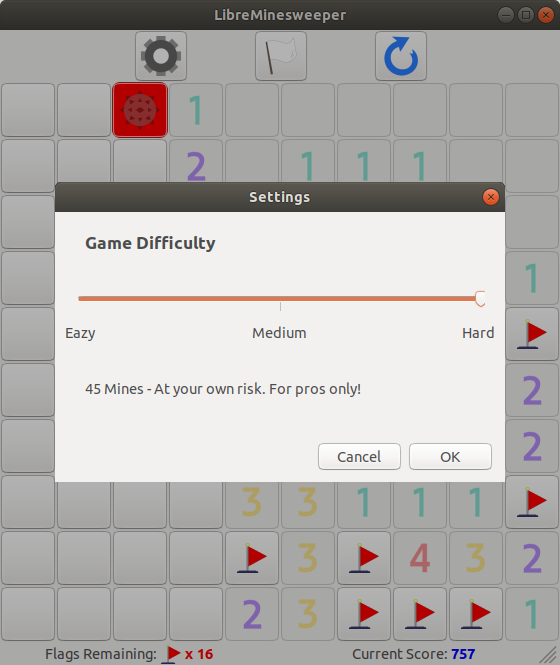
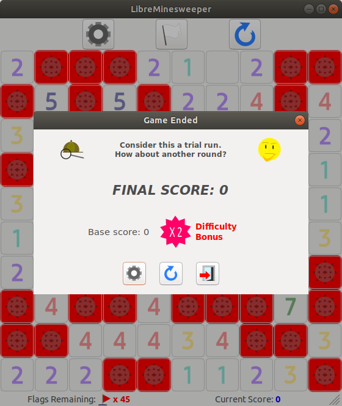
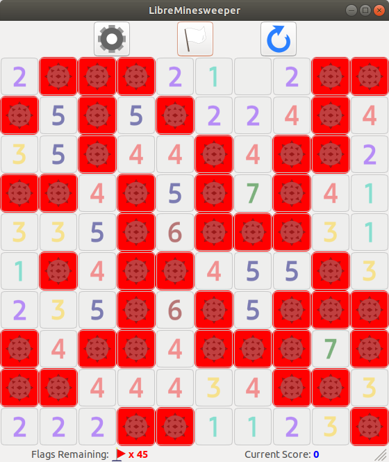
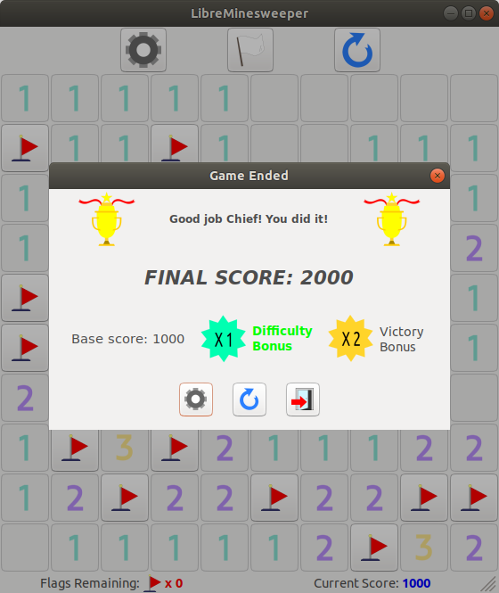

# LibreMinesweeper
A minesweeper recreation as a desktop application built using the [wxWidgets](https://github.com/wxWidgets/wxWidgets) framework.

The application current supports Linux platforms with GTK-compatible toolkits. Since wxWidgets applications can be built cross-platform, MS Windows support might be added in the future.

If you do not want to build your own executable, this repository contains a pre-built package for Linux x86 [here](BUILDS/Linux_GTK_x86_Build.zip) (SHA-1 sum: 335c6afa37d3788200f429d3d797a4f52db46466). __However__, please do understand that this package and this project __do not__ come with any warranty WHATSOEVER.

### Screen Captures

  </img>
  
  </img>
  </img>
  </img>
  </img>
  </img>
  </img>

### Build and Setup Instructions
N.B. The following instructions applies to Linux platforms using GCC as build tools (as an example approach).

#### Prerequisites:
- Install wxWidgets library
- Install GCC

#### Steps:
- Download/clone the repository and `cd` into the directory of your local copy.
- To build a binary statically linked to wxWidgets run the following command `` g++ -o LibreMinesweeper cApp.cpp cMain.cpp `wx-config --static=yes --cxxflags --libs` ``. Otherwise, to build a binary dynamically linked to wxWidgets run the following command `` g++ -o LibreMinesweeper cApp.cpp cMain.cpp `wx-config --static=no --cxxflags --libs` ``. Upon a successful build, `LibreMinesweeper` would be the new executable.
- If you plan to move/copy the built binary to another location, make sure to have a copy of the [`Resources/`](Resources/) folder and its contents at the destination since it contains the image assets used by the application.

### Acknowledgement
This work is inspired by and based on that of [_javidx9_](https://www.youtube.com/watch?v=FOIbK4bJKS8).
